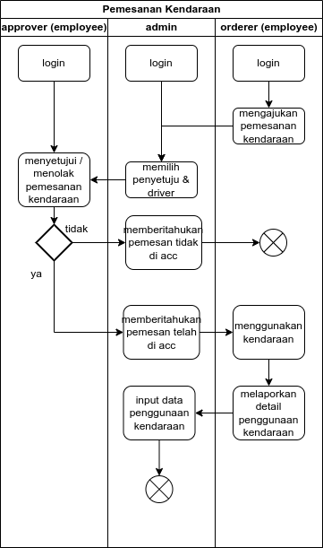
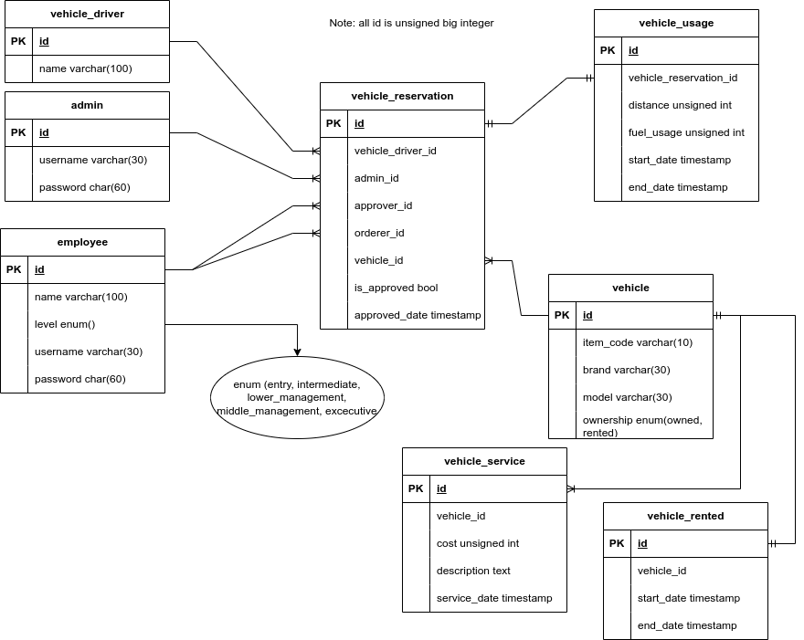

# VEHICLE RESERVATIONS

- catatan, terkadang saya menggunakan kata memesan dan mengajukan, tapi maksudnya sama.

- [Requirements](#requirements)
- [Roadmap](#roadmap)
- [Installation](#installation)
- [Usage](#usage)
- [Technical](#technical)

## REQUIREMENTS

### high level
- terdapat dua user (admin dan pihak yang menyetujui) 
- admin dapat menginput pemesanan kendaraan dan menentukan driver serta pihak yang menyetujui pemesanan
- Persetujuan dilakukan berjenjang minimal 2 level (level jabatan?)
- pihak yang menyetujui dapat melakukan persetujuan melalui aplikasi
- terdapat dashboard yang menampilkan grafik pemakaian kendaraan
- terdapat laporan periodik pemesanan kendaraan yang dapat di export

## ROADMAP
- database design, migration, model, seeder  ✅
- autentikasi admin, employee ✅
- pemesanan kendaraan (employee) ✅
- pemrosesan pemesanan kendaraan (admin) ✅
- persetujuan pemesanan kendaraan (employee dengan jabatan dua tingkat diatas pemesan kendaraan) ✅
- laporan penggunaan oleh pemesan kendaraan
- statistik penggunaan kendaraan (admin)

## INSTALLATION

- kebutuhan sistem
    - php 8.2
    - composer
    - sql database (mysql, sqlite, mariadb)

- clone repository ini
- copy file _'.env.example'_ ke _'.env'_
- di file _'.env'_
    - ubah APP_NAME menjadi terserah
    - ubah konfigurasi database sesuai yang diinginkan
- jalankan:
```bash
php artisan key:generate # buat secret key
php artisan migrate # buat tabel - tabel database
php artisan db:seed # tambahkan data - data contoh 
php artisan serve # jalankan server development
```


## USAGE

_diurutkan berdasarkan [diagram](#diagram-penggunaan-aplikasi) ini_

### Employee (pemesan)
- login sebagai karyawan yang akan memesan kendaraan
(username:  alfarizi, password: rahasia)
- klik tombol 'Pengajuan Kamu' di sidebar
- klik ajukan kendaraan
- pilih kendaraan yang akan dipesan
- klik tombol ajukan kendaraan

_skenarionya karyawan ini menunggu hasil pengajuan kendaraan tersebut_

- klik tombol detail untuk melihat status perizinan, pemberi izin, admin pemroses dan pengemudi kendaraan. (belum ada fitur notifikasi, jadi harus dicek secara berkala)

### Admin
- login sebagai admin (jika sedang menggunakan akun karyawan klik logout di kiri bawah) (username: admin, password: admin)
- klik tombol 'Pemesanan Kendaraan' di sidebar
- di dalam baris tabel, jika yang muncul link proses, maka pemesanan belum diproses, jika yang muncul link rincian, maka pemesanan sudah diproses
- klik proses untuk memproses pemesanan kendaraan
- pilih pengemudi dan pemberi izin (pemberi izin yang muncul adalah karyawan dengan jabatan dua tingkat diatas pemesan, tapi fitur ini bisa dieksploit karena belum ada validasi di backendnya)
- klik tombol proses di bawah, maka halaman akan pindah ke rincian pemesanan kendaraan.

### Employee (pemberi izin)
- login sebagai employee (username: fajar, password: rahasia)
- klik tombol 'Daftar Persetujuan Kendaraan' di sidebar
- klik tombol 'Detail & Approve' di dalam baris tabel untuk melihat rincian, memberi / menolak pemesanan kendaraan
- scroll ke bawah dan pilih tombol izinkan atau tolak pemesanan kendaraan
- selesai

## TECHNICAL
### Diagram Penggunaan Aplikasi
[penggunaan](#usage)


### ERD
